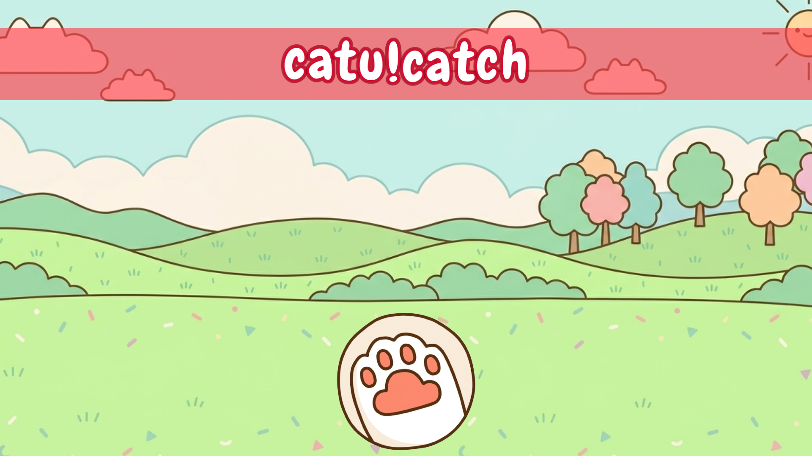
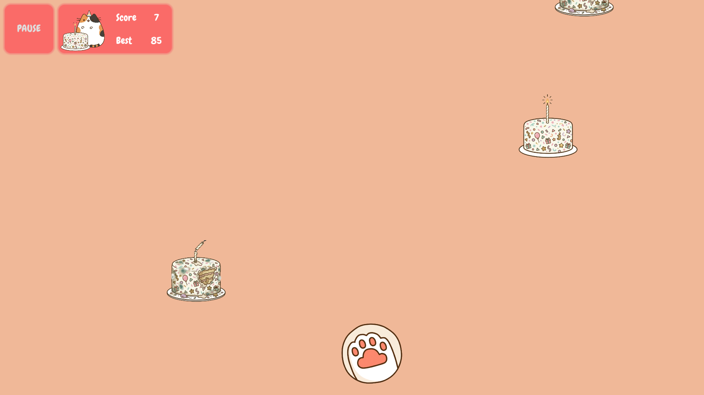
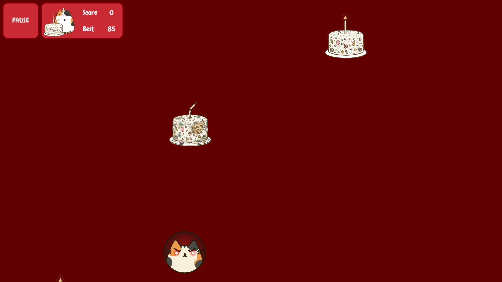

# catu!catch

A fast-paced arcade game built with **Godot Engine 4.x**. 

## Gameplay

- **Goal:** Catch as many delicious cakes as possible to score points. 

- **Challenge:** Avoid spoiled food and obstacles that get in your way. 

- **Speed:** The higher your score, the faster the treats fall!

## Features

- Cross-platform support (Linux, Windows, Android).
- Automated build system using `Makefile`.
- Optimized for performance and headless exports.

---

## Install & Run

The game is portable and doesn't require an installer, so all you need to do is download it from Releases and run it.

---

## Build

This project uses a `Makefile` to simplify the exporting process. You don't need to open the Godot Editor to create builds.

### Requirements

1. **Godot Engine 4.x**: Ensure the `godot` executable is in your system `PATH`.
2. **Android SDK & Build Tools**: Required for Android exports.
3. **Java Development Kit (JDK)**: Required for generating the signing keystore.

### Android

For security reasons, the release keystore is **not included** in this repository. To build the Android version, you must generate your own and link it to the project:

1. **Generate your keystore** (using a default password for simplicity):
   
   ```bash
   keytool -genkey -v -keystore catucatch.keystore -alias catucatch -keyalg RSA -keysize 2048 -validity 10000 -storepass catucatchpass -keypass catucatchpass
   ```

> **Note**: You can use a different password, but make sure to remember it for the next step.

2. **Configure Export Settings**:
   
   - Open the project in **Godot Editor**.
   - Go to **Project -\> Export...** and select the **Android** preset.
   - In the **Options** tab, scroll down to the **Keystore** section.
   - Fill in the following fields in the **Release** subsection:
     - **Release Keystore**: Path to your `catucatch.keystore` file.
     - **Release User**: `catucatch`
     - **Release Password**: `catucatchpass` (or your custom password).

3. **Build**:
   
   ```bash
   make android
   ```

-----

### Linux & Windows

To build for desktop platforms, simply run:

```bash
make linux
# or
make windows
```

### Clean Artifacts

To remove all generated builds and start fresh:

```bash
make clean
```

-----

## Screenshots

| Splash Screen                                                    | Main Menu                                        |
|:----------------------------------------------------------------:|:------------------------------------------------:|
|              |  |
| **Gameplay**                                                     | **Game Over**                                    |
|  |  |

-----

**Happy catching\!**
